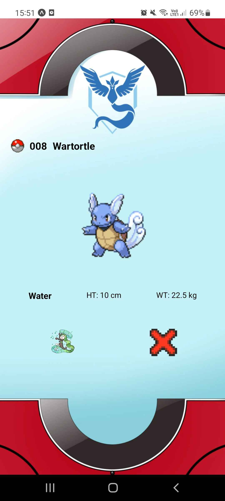

# PokedexReactNative

Une application mobile développée en React Native TypeScript 
pour recréer un Pokedex Pokemon, permettant aux utilisateurs parcourir 
les pokemons existant ainsi avoir les informations de ceux-ci.

## Auteurs

- [@BluedyAishela_](https://github.com/BluedyRimuru)
- [@Neleoko](https://www.github.com/Neleoko)


## Lancement du projet

Pour pouvoir lancer l'application :

- Installez l'application Expo Go sur votre mobile
- Exécutez la commande `npm start`
- Scannez le QRCode sur l'application Expo Go

## Installation du projet

Cloner le projet.

```bash
  git clone git@github.com:ORT-Project/PokedexReactNative.git
```

Aller dans le projet.

```bash
  cd PokedexReactNative
```

Installer les dépendances.

```bash
  npm install
```

Démarrer le server.

```bash
  npm start
```

Exécuter les tests unitaires.

```bash
  npm test
```
<div style="display: flex;">
    
    
</div>
